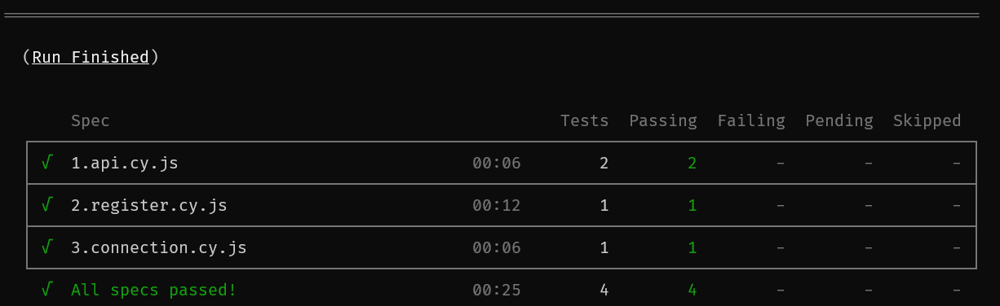

# Procédure d'installation

## Prérequis
* Remplir le .env avec les informations de connexion à la base de données
* Avoir composer installé sur la machine
* Avoir php installé sur la machine
* Avoir npm installé sur la machine
* Avoir symfony installé sur la machine
* Avoir un serveur de base de données (MySQL, MariaDB, PostgreSQL, etc.)

## Commandes à exécuter

Installer les dépendances
```bash
composer install
npm i
```

Créer la structure de la base de données
```bash
php bin/console doctrine:database:create
php bin/console doctrine:migrations:migrate
yarn encore production
```

Lancer le serveur
```bash
symfony server:ca:install
symfony server:start -d
```

Le site web est alors accessible à l'adresse https://127.0.0.1:8000, allez à cette adresse afin de vous assurer que cela a fonctionné

## Réponses aux questions

1. Explication du test de charge  
J'ai augmenté petit à petit le nombre d'utilisateurs impactant l'API `https://reqres.in/api/users`  
J'ai eu le temps de monter jusqu'à 6000 utilisateurs en simultanée ce qui n'a pas généré d'erreur sur l'API  
Le fichier contenant mon test est `./Exo1.jmx` 
2. Explication choix technologique  
J'ai choisi d'utiliser jMeter car nous avions déjà mis en place une configuration ce qui m'a permi de gagner le temps que j'ai perdu à combattre les lenteurs de mon PC
3. Explication résultats  
Le taux d'erreur n'a pas augmenté, ce qui signifie que les serveurs de l'API que j'ai testé supporte la connexion de plus de 6000 utilisateurs simultanément

* 1.api.cy.js : Test l'accès à une route de l'API en fonction de si l'on est connecté ou non
* 2.register.cy.js : Test la création de compte + le fait que l'on voit les utilisateurs + déconnexion et le fait qu'on ne puisse pas retourner sur le dashboard
* 3.connection.cy.js : Test la connexion + le fait que l'on voit les utilisateurs + l'accès aux détails d'un utilisateur

Tous les tests passent en utilisant la UI de Cypress, mais il arrive qu'ils plantent avec la commande run. Principalement register. Je pense que c'est à cause de la lenteur du build de dev de Symfony.  


La vidéo se trouve dans ./docs/TD_proof.mp4

Pour lancer les tests :
```bash
npx cypress run
# ou
npx cypress open
```
Pour éteindre le serveur PhP :

```bash
symfony server:stop
```